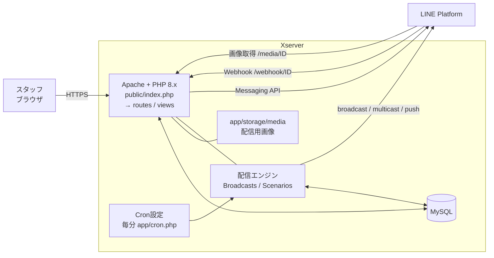
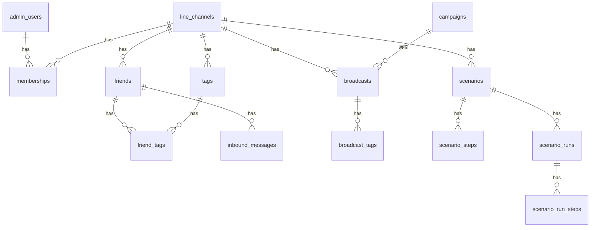
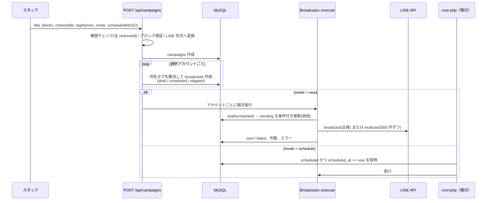

# 接骨院 LINE 一括配信システム（Xserver 版）設計書

| 項目 | 内容 |
|---|---|
| 対象 | `line-broadcast-xserver/`（PHP + MySQL。Xserver のレンタルサーバー向け） |
| 版 | 1.0 |
| 利用者 | 本部スタッフ（管理者）、各店舗スタッフ（オペレーター） |

---

## 1. 目的・方針

- 8 以上ある接骨院の公式LINEアカウントに、イベント情報などを**1 回の操作でまとめて配信**する。配信先の店舗は選択で絞れる。通常の公式LINEの配信設定（日時・タグ・テキスト/画像/リッチ/カード）を一通り扱える。
- **Xserver のレンタルサーバーで動かす**。Xserver は PHP + MySQL 前提で、Node.js の常駐プロセスを動かせないため、Next.js 版（`line-broadcast/`、Vercel + PostgreSQL 前提）とは別に、**PHP で作り直した**。機能は同等で、ロジック（メッセージ変換、タグ突き合わせ、ステップ配信の時刻計算）は Next.js 版と同じ仕様に揃えている。
- 導入のしやすさを重視：外部ライブラリ（Composer）なし、FTP アップロード + ブラウザ上のインストーラーで完結。

### スコープ外
公式アカウントマネージャーの機能（リッチメニュー、あいさつ、チャット応対）、LIFF、予約・決済連携、AI 自動応答。

---

## 2. 全体構成

| レイヤ | 技術 |
|---|---|
| サーバー | Xserver（Apache、PHP 8.1+） |
| DB | MySQL 5.7+ / MariaDB 10.3+（InnoDB、utf8mb4）。PDO |
| 画面 | PHP テンプレート + Tailwind CSS（ビルド済みを同梱）+ Alpine.js（同梱） |
| LINE 連携 | cURL による Messaging API 呼び出し（SDK 不使用） |
| 認証 | PHP セッション（Cookie: HttpOnly / SameSite=Lax / HTTPS 時 Secure） |
| 定期実行 | Xserver の「Cron設定」から `app/cron.php`（CLI）を毎分実行 |

### Next.js 版との違い

| 項目 | Next.js 版 | Xserver 版 |
|---|---|---|
| 実行環境 | Vercel + PostgreSQL | Xserver（PHP + MySQL） |
| 定期実行 | 外部 Cron サービスが HTTP を叩く | サーバー内 cron が CLI を実行（HTTP 公開不要） |
| 画像の保存 | DB（bytea） | ファイル（`app/storage/media/`、メタ情報は DB） |
| 認証情報の保存 | 平文 | **AES-256-GCM で暗号化**（鍵は `config.php`） |
| ログイン保護 | なし | **15 分で 10 回失敗すると IP 単位でブロック** |
| 単独アカウントの配信 | 専用フォーム（テキストのみ） | 一括配信の作成画面に統合（アカウントを 1 つ選ぶだけ。全種別のメッセージが使える） |
| 送信中断 | `sending` のまま残る | **15 分で失敗扱いに自動更新**（自動再送はしない） |
| 日時 | 画面・入力とも日本時間（修正済み） | DB は UTC、画面は日本時間 |

---

## 3. 機能一覧・画面

| 機能 | 概要 | URL |
|---|---|---|
| 全店舗 一括配信 | アカウント選択 → 日時 → タグ → メッセージ → 配信 | `/campaigns`, `/campaigns/new`, `/campaigns/{id}` |
| ステップ配信 | きっかけ（友だち追加／タグ付与）で順番に自動配信 | `/c/{ch}/scenarios` |
| 友だち・タグ | 一覧・検索・メモ・タグ付け外し | `/c/{ch}/friends`, `/c/{ch}/tags` |
| 配信履歴 | アカウント別の配信一覧 | `/c/{ch}/broadcasts` |
| アカウント管理（管理者） | LINE アカウントの登録・設定・削除、担当者の割り当て | `/channels`, `/c/{ch}/settings` |
| Webhook | 友だち追加／ブロック／メッセージ受信の同期 | `POST /webhook/{ch}` |
| 画像 | アップロード／配信用の公開 | `POST /api/media`, `GET /media/{id}[/{size}]` |
| 定期実行 | 予約配信・ステップ配信の送信 | `app/cron.php`（CLI）、任意で `GET /cron?key=…` |

### 一括配信の作成画面

左：フォーム（①アカウント → ②日時 → ③オーディエンス → ④メッセージ）、右：LINE 風プレビュー。

| メッセージ種別 | 入力 | 制限 |
|---|---|---|
| テキスト | 本文 | 5,000 文字 |
| 画像 | 画像ファイル | JPEG/PNG。ブラウザで幅 1024px・900KB 以下に縮小してアップロード |
| リッチメッセージ | 画像、レイアウト（全面1／左右2／上下2／3列／4／6分割）、エリアごとの動作（リンク or テキスト送信）、代替テキスト | 幅 1040px に縮小。リンクは `https?://` `tel:` `line://` のみ |
| カード | 代替テキスト、カード（画像任意・タイトル40字・説明60字・ボタン最大3つ） | 最大 10 枚。名前もリンクも空のボタン行は無視 |

「いますぐ配信」は、対象アカウント名・対象（全員／タグ）を示す確認ダイアログを必ず表示する。

---

## 4. データモデル

| テーブル | 役割 |
|---|---|
| `admin_users` | ログインユーザー（`super_admin` / `operator`）。パスワードは `password_hash` |
| `line_channels` | LINE 公式アカウント。`access_token` / `channel_secret` は**暗号化済み文字列**（`v1:` + base64） |
| `memberships` | オペレーターと担当アカウントの対応 |
| `friends` | 友だち（アカウント内で `line_user_id` 一意）。`is_following`、メモ |
| `tags` / `friend_tags` | タグ（アカウント内で名前一意）/ 付与 |
| `inbound_messages` | 受信メッセージ履歴 |
| **`campaigns`** | **一括配信の親**。`blocks`（編集内容）、`messages`（LINE 形式に変換済）、`audience_tag_names` |
| **`broadcasts`** | **アカウント 1 つ分の配信**。`status`、`scheduled_at`、件数、エラー |
| `broadcast_tags` | その配信の対象タグ（アカウントごとに解決済み） |
| `scenarios` / `scenario_steps` | ステップ配信の定義（`delay_minutes`、`send_time` "HH:mm"、`blocks`/`messages`） |
| `scenario_runs` / `scenario_run_steps` | 友だちごとの進行状況（`scenario_id × friend_id` で一意）。`scheduled_at`、`status` |
| `media` | 画像のメタ情報（実体は `app/storage/media/{id}`） |
| `login_attempts` | ログイン失敗の記録（ブルートフォース対策） |

日時はすべて **UTC** で保存し、表示時に日本時間（Asia/Tokyo）へ変換する。

---

## 5. 一括配信の処理

### 状態遷移（broadcasts.status）

`draft` / `scheduled` / `skipped`（作成時）→ `sending` → `sent` / `failed`。`draft`・`scheduled` は `cancelled` にできる。
`sending` のまま 15 分経過したものは cron が `failed`（「送信中に中断。LINE 側で配信済みの可能性。自動再送なし」）にする。
キャンペーン全体の表示は子の状態から導出：送信中 > 予約済 > 下書き > 一部失敗（成功と失敗が混在）> 失敗 > 送信済 > 取消。

### オーディエンス

| 指定 | 動作 |
|---|---|
| 友だち全員 | LINE `broadcast` API |
| タグ指定 | そのアカウントの該当タグが付いた `is_following` の友だちを集め、`multicast`（500 件ずつ）。チャンクごとの成否で成功/失敗件数を記録 |
| タグ指定だが当該アカウントに同名タグが無い | **`skipped`（配信しない）**。全員配信にフォールバックしない |

### 二重送信の防止
- `UPDATE … SET status='sending' WHERE id=? AND status IN ('draft','scheduled')` の影響行数で排他的に確保（手動実行と cron が重なっても 1 回だけ）。
- LINE の `X-Line-Retry-Key`（UUID）を付けて送信し、通信エラー時は同じキーで最大 2 回再試行。LINE が 409 を返せば「受付済み」とみなす。
- cron は `flock` で多重起動を防ぐ。

---

## 6. メッセージ変換（`Blocks`）

編集用ブロックをサーバー側で検証し、LINE 形式へ変換する（入力を信用しない）。

| ブロック | LINE メッセージ | 備考 |
|---|---|---|
| text | `text` | |
| image | `image` | URL は `{公開URL}/media/{id}` |
| rich | `imagemap` | `baseUrl={公開URL}/media/{id}`（LINE が末尾に `/1040` 等を付けて取得）。`baseSize`＝1040×(1040×縦横比)。タップ領域は割合から px 算出。動作は `uri` / `message` |
| cards | `flex`（`carousel` of `bubble`） | hero 画像(20:13)、タイトル、説明、footer にボタン（1 つ目 primary） |

画像 ID は `media` に存在するものだけ許可。リンクは `https?://` `tel:` `line://` のみ（`javascript:` 等は拒否）。

---

## 7. ステップ配信

- **開始**：友だち追加（`follow`）またはタグ付与で、有効なシナリオを開始。**有効にした以降**に起きた人から。同じ人に同じシナリオは 1 回のみ（`scenario_runs` の一意制約 + `INSERT IGNORE`）。
- **送信時刻**は開始時に全ステップ分を確定（`scenario_run_steps.scheduled_at`）。起点は直前ステップの送信予定。

| 指定 | 送信予定 |
|---|---|
| 経過時間 | 直前 + `delay_minutes` |
| 日数＋時刻 | 直前の日付（JST）の `delay_minutes/1440` 日後の `HH:mm`。0 日後で既に過ぎていれば「すぐ」 |

- **送信**：cron が `pending` かつ時刻到来のステップを `sending` に確保して `push`。ブロック中・アカウント無効は `skipped`。`sending` で 15 分止まったものは `failed`。全ステップ完了で run を `completed`。
- **編集**：ステップは順番(`step_order`)ごとに上書きし、減った分だけ削除（進行中の友だちの送信待ちを消さない）。進行中の未送信分は本文が新内容になり、送信予定日時は変わらない。
- **コピー**：他アカウントへ**無効**で作成。タグトリガーはタグ名で対応づけ、無ければ同名タグを作成。

---

## 8. 認証・認可・セキュリティ

| 項目 | 内容 |
|---|---|
| ロール | `super_admin`：全アカウント・アカウント管理・担当者管理。`operator`：`memberships` の担当アカウントのみ |
| 一括配信 | 指定された**全 `channelIds` の権限をサーバーで再検証**。1 つでも担当外なら 403。一覧/詳細/実行/取消も担当アカウント分のみ |
| CSRF | 全 POST にトークン検証（フォームは `_csrf`、API は `X-CSRF-Token`）。Webhook と cron のみ除外 |
| Webhook | `x-line-signature`（HMAC-SHA256、チャネルシークレット）を検証。無効アカウントは 403 |
| 認証情報の保護 | LINE トークン/シークレットは AES-256-GCM で暗号化（鍵 `app_key`＝`config.php`）。DB だけが漏れても読めない |
| ログイン | `password_hash`（bcrypt）、15 分 10 回で IP ブロック、ログイン成功時にセッション ID 再生成 |
| 画像 | 実ファイルの種別を `getimagesize` で判定、3MB 上限、ID は 32 桁ランダム。`/media/` は認証不要（LINE が取得するため） |
| ファイル配置 | `app/`（コード・設定・画像実体）は Web 公開外。万一公開領域に置いても `app/.htaccess` で拒否 |
| ヘッダ | `X-Frame-Options`, `X-Content-Type-Options`, `Referrer-Policy`, 画面は `Cache-Control: no-store` |
| インストーラー | 完了後に自己削除。`config.php` は 0600 |

---

## 9. 運用

- 導入：[Xserver導入手順書](Xserver導入手順書.md)、LINE 接続：[アカウント接続手順書](アカウント接続手順書.md)
- **cron が止まるとダッシュボード（管理者）に警告**、ステップ配信画面にも「送信予定を過ぎた未送信」の警告を表示。
- バックアップ：DB（phpMyAdmin エクスポート）、`app/storage/media/`、`app/config.php`（`app_key` を含む）。

## 10. 制約・注意

| # | 内容 |
|---|---|
| 1 | LINE の月間メッセージ配信数の上限は**アカウントごと**に消費される（8 アカウントなら各アカウントの友だち数ぶん）。 |
| 2 | **タグ配信・ステップ配信は、本システムが把握している友だちだけが対象**。Webhook 設定前から友だちだった人は、メッセージ送信/再フォローで把握されるまで対象外。「友だち全員」配信は影響を受けない。 |
| 3 | 予約配信は cron の間隔（毎分）分の遅延が出る。cron 停止中は送信されない。 |
| 4 | 即時配信は同期処理。アカウント数が非常に多い場合は PHP の実行時間制限（`set_time_limit(300)` を設定）に依存。 |
| 5 | リッチメッセージの画像は JPEG 化・幅 1040px 化される（透過 PNG は白背景）。 |
| 6 | LINE が画像を取得できるよう、HTTPS の公開URLで稼働している必要がある。 |

## 11. テスト

`tests/` に自動テストを同梱（開発者向け）。実 LINE には送らず、モックで検証する。

- `tests/run.php`（結合 167 項目）：インストーラー、ログイン/CSRF/ブルートフォース、アカウント登録（暗号化）、Webhook（署名・友だち同期）、画像、一括配信（全員/タグ/skipped/一部失敗/予約/下書き/取消/二重実行防止/中断検知）、権限、ステップ配信（開始・時刻・編集・ブロック・タグ・コピー）、アカウント設定、主要ページ、日本時間計算。
- `tests/ui.js`（ブラウザ 36 項目）：メッセージエディタ（画像縮小アップロード、リッチ/カード、並べ替え）、予約日時が日本時間のまま保存されること、ステップ配信画面、JavaScript エラーなし。

## 12. 今後の改善候補

既存の友だちの一括取り込み（LINE の Get follower IDs API。認証済み/プレミアムアカウントのみ）、店舗グループの保存、配信前の対象人数見積もり、テスト配信（自分のみ）、配信の複製、配信結果（開封/クリック）の集計、画像のオブジェクトストレージ化。
