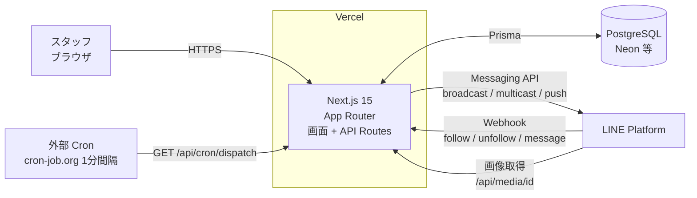
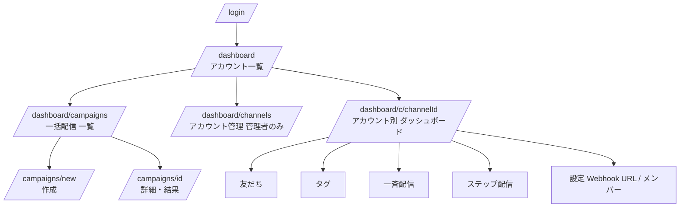
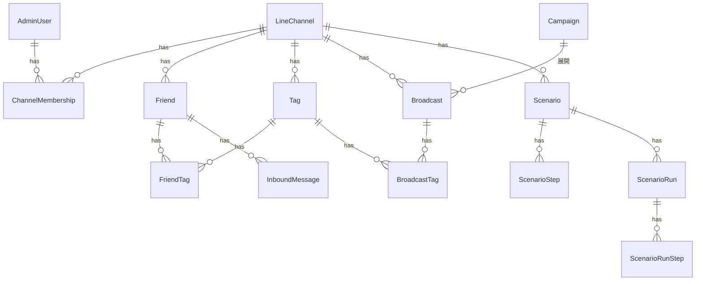
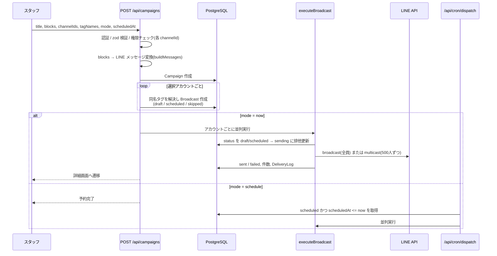
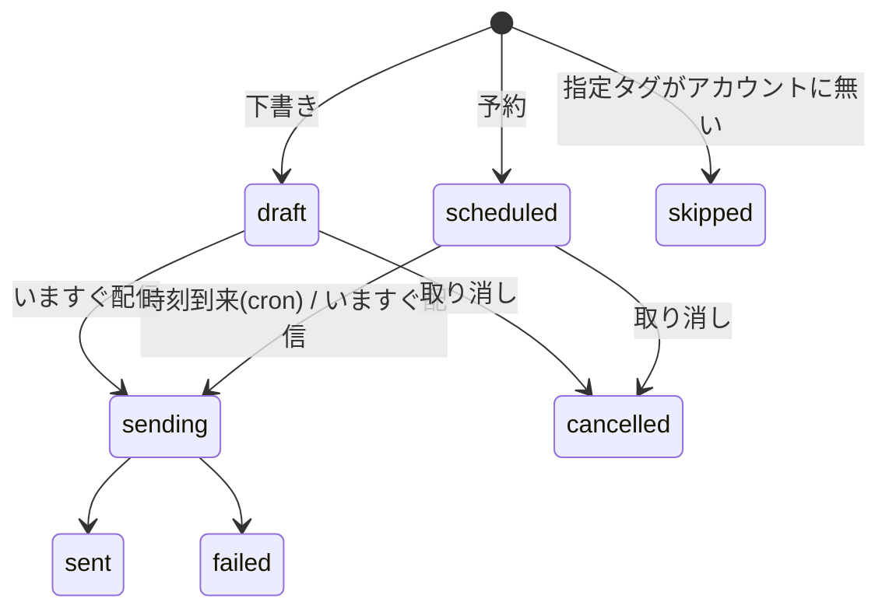

# 接骨院 LINE 一括配信システム 設計書

| 項目 | 内容 |
|---|---|
| 対象 | `line-broadcast/`（接骨院事業専用・他プロジェクトから独立） |
| 版 | 1.1（ステップ配信の設定画面刷新、単独配信の日時不具合修正を反映） |
| 想定利用者 | 本部スタッフ（管理者）、各店舗スタッフ（オペレーター） |

---

## 1. 目的・背景

- 接骨院の公式LINEアカウントが 8 以上あり、イベント情報などを全アカウントに個別に配信するのが手間になっている。
- **1 つのシステムに複数アカウントを接続し、アカウントを切り替えずに**、通常の公式LINEの配信設定（配信日時・オーディエンス・メッセージ種別）を一通り設定して一括配信できるようにする。
- 配信先の店舗は選択で絞れるようにする。

### 1.1 スコープ

| 区分 | 内容 |
|---|---|
| 対象内 | 複数アカウント接続、一括配信（日時・タグ・テキスト/画像/リッチ/カード）、友だち・タグ管理、アカウント単独の配信、ステップ配信、ユーザー権限管理 |
| 対象外 | LINE公式アカウントマネージャー上の機能（リッチメニュー、あいさつメッセージ、チャット応対 等）、LIFF、予約・決済連携、AI自動応答 |

---

## 2. 全体構成

| レイヤ | 採用技術 |
|---|---|
| フロント/サーバ | Next.js 15 (App Router) / React 19 / TypeScript / Tailwind CSS |
| DB | PostgreSQL + Prisma 5（スキーマ反映は `prisma db push`、ビルド時に実行） |
| 認証 | NextAuth（Credentials、JWT セッション 7 日）、パスワードは bcrypt |
| LINE 連携 | `@line/bot-sdk` |
| 入力検証 | zod |
| ホスティング | Vercel（Root Directory = `line-broadcast`） |
| 定期実行 | 外部 Cron（予約配信・ステップ配信の実行） |

---

## 3. 機能一覧

| # | 機能 | 概要 | 画面/API |
|---|---|---|---|
| F1 | アカウント接続 | LINE公式アカウント（チャネル）をトークン/シークレットで登録。登録時に認証情報を検証 | `/dashboard/channels` |
| F2 | **全店舗一括配信** | 複数アカウントを選び、1 回の作成でまとめて配信 | `/dashboard/campaigns` |
| F2-1 | 配信アカウント選択 | チェックボックス（全選択/全解除）。権限のあるアカウントのみ | 作成画面 §1 |
| F2-2 | 配信日時 | すぐ配信 / 日時指定（予約）/ 下書き | 作成画面 §2 |
| F2-3 | オーディエンス | 友だち全員 / タグ絞り込み（同名タグで各アカウントに展開） | 作成画面 §3 |
| F2-4 | メッセージ作成 | 最大 5 吹き出し。テキスト・画像・リッチメッセージ・カード | 作成画面 §4 |
| F2-5 | 結果確認・操作 | アカウント別の状態、いますぐ配信、取り消し | `/dashboard/campaigns/{id}` |
| F3 | 友だち管理 | Webhook で自動同期、検索、メモ、タグ付け外し | `/dashboard/c/{ch}/friends` |
| F4 | タグ管理 | アカウント単位のタグ（名前・色） | `/dashboard/c/{ch}/tags` |
| F5 | アカウント単独の一斉配信 | 1 アカウントにテキスト配信（全員/タグ/予約） | `/dashboard/c/{ch}/broadcasts` |
| F6 | ステップ配信 | 友だち追加/タグ付与をきっかけに、メッセージを自動で順番に配信。画面で設定（§6A） | `/dashboard/c/{ch}/scenarios` |
| F7 | 権限管理 | 管理者は全アカウント、オペレーターは割り当てアカウントのみ | 設定画面 / `ChannelMembership` |

---

## 4. 画面構成

### 4.1 一括配信 作成画面

左：入力フォーム（①アカウント → ②日時 → ③オーディエンス → ④メッセージ）、右：LINE風プレビュー（固定表示）。

| ブロック | 入力項目 | 制限 |
|---|---|---|
| テキスト | 本文 | 5,000 文字 |
| 画像 | 画像ファイル | JPEG/PNG。ブラウザで長辺 1024px・JPEG 900KB 以下に縮小して送信 |
| リッチメッセージ | 画像、レイアウト（1/左右2/上下2/3列/4/6分割）、エリアごとの動作（リンク or テキスト送信）、代替テキスト | 横 1040px に縮小。リンクは `https?://` `tel:` `line://` のみ |
| カード | 代替テキスト、カード（画像任意・タイトル 40 字・説明 60 字・ボタン最大 3 つ（名前 20 字）） | カード最大 10 枚 |

操作時の安全策：「いますぐ配信」は対象アカウント名・対象（全員/タグ）を示す確認ダイアログを必ず表示する。

---

## 5. データモデル

| テーブル | 役割 | 主な項目 |
|---|---|---|
| `AdminUser` | 管理画面ユーザー | email（一意）, passwordHash, role（`super_admin` / `operator`） |
| `LineChannel` | 接続するLINE公式アカウント（=店舗） | name, color, channelAccessToken, channelSecret, isActive |
| `ChannelMembership` | ユーザー×アカウントの権限 | adminUserId, lineChannelId（組で一意） |
| `Friend` | 友だち（アカウント単位） | lineUserId（アカウント内で一意）, isFollowing, displayName, notes |
| `Tag` / `FriendTag` | タグ（アカウント単位・名前はアカウント内で一意）/ 付与 | name, color |
| `InboundMessage` | 受信メッセージ履歴 | type, text, raw |
| **`Campaign`** | **一括配信の親** | title, blocks（編集内容）, messages（LINE形式に変換済）, audienceTagNames, scheduledAt, createdById |
| `Broadcast` | **アカウント 1 つ分の配信**（一括配信の子 / 単独配信も共用） | lineChannelId, campaignId?, messages, status, scheduledAt, sentAt, totalTargets, errorMessage |
| `BroadcastTag` | 配信先タグ（Broadcast ごとに解決済みの Tag） | broadcastId, tagId |
| **`Media`** | **配信用画像（バイナリ）** | contentType, data(bytea), width, height |
| `Scenario` / `ScenarioStep` / `ScenarioRun` / `ScenarioRunStep` | ステップ配信 | トリガー、待ち時間(`delayMinutes`)、送信時刻(`sendTime` "HH:mm" JST)、編集用`blocks`と送信用`messages`、友だちごとの進行状況 |
| `DeliveryLog` | 配信ログ | channel(broadcast/multicast/push), status |

設計上のポイント：

- **「Campaign（1 回の指示）」→「Broadcast（アカウントごと）」の 2 階層**にし、実際の送信・状態管理・失敗追跡は既存の Broadcast 単位に統一した。アカウントごとに成功/失敗が独立して分かる。
- タグは**アカウントごとに別のレコード**。一括配信では「タグ名」で指定し、作成時に各アカウントの同名タグへ解決して `BroadcastTag` に保存する。

---

## 6. 一括配信の処理設計

### 6.1 シーケンス

### 6.2 配信状態（Broadcast.status）

Campaign 全体の表示状態は子 Broadcast から導出する（`summarizeStatus`）：送信中 > 予約済 > 下書き > 一部失敗（成功と失敗が混在）> 失敗 > 送信済 > 取消。

### 6.3 オーディエンス解決

| 指定 | 動作 |
|---|---|
| 友だち全員 | LINE `broadcast` API（そのアカウントの全友だち） |
| タグ指定 | 該当アカウントのタグが付いた `isFollowing` 友だちの `lineUserId` を集め、`multicast`（500 件ずつ分割、並列） |
| タグ指定だが当該アカウントに同名タグが無い | **`skipped`（配信しない）**。全員配信にフォールバックしない |

### 6.4 排他制御・並列性

- `executeBroadcast` は `status IN (draft, scheduled)` → `sending` を条件付き更新（`updateMany`）で確保し、手動実行と cron の重なりによる**二重送信を防止**する。
- 即時配信・cron 配信ともアカウント間は並列実行（8 アカウントでも Vercel の最大 60 秒内に収める）。

---

## 6A. ステップ配信の設計

### 画面（`/dashboard/c/{ch}/scenarios`）

- **一覧**：ステップ配信の説明、シナリオごとに「開始条件」「ステップの流れ（例：すぐ → 1日後 10:00 → 7日後 10:00）」「進行中/完了の人数」、有効/無効の切替、**他の店舗へコピー**、削除。送信予定を 10 分以上過ぎた未送信がある場合は cron 停止の警告を表示。
- **作成/編集**：①基本設定 → ②トリガー（友だち追加時 / タグが付いたとき）→ ③ステップ。サンプル（初回来院フォロー）をワンクリックで入力可能。
  - ステップのタイミングは 2 通りから選択：**経過時間**（前のステップから N 分/時間/日後）／**日数＋時刻**（前のステップの N 日後の HH:mm、日本時間）。各ステップに「トリガーから約〇〇後」の目安を表示。
  - 各ステップの内容は一括配信と同じメッセージエディタ（テキスト/画像/リッチ/カード、最大 5 吹き出し）とプレビュー。最大 30 ステップ。
- **進行状況**（編集画面）：開始した人数、ステップごとの送信済/送信待ち/失敗・スキップ件数。

### スケジュール計算（`computeStepTime`）

友だち追加（またはタグ付与）の時点で、全ステップの送信予定を `ScenarioRunStep.scheduledAt` に確定させる。起点は直前ステップの送信予定。

| 指定 | 送信予定 |
|---|---|
| 経過時間 | 直前 + `delayMinutes` |
| 日数＋時刻 | 直前の日付（JST）の `delayMinutes/1440` 日後の `HH:mm`。0 日後で既にその時刻を過ぎていれば直前（=すぐ） |

### 開始条件・重複
- 開始されるのは、シナリオが**有効な間**にきっかけが起きた人から。既存の友だちには送られない。
- 同じ人に同じシナリオは 1 回のみ（`ScenarioRun` は `scenarioId × friendId` で一意）。
- 送信時にブロック中の友だちは `skipped`。

### 編集時の挙動
- ステップは順番(`order`)ごとに**上書き**し、減った分だけ削除する（全削除→再作成だと進行中の友だちの送信待ちが消えるため）。
- 進行中の友だちの未送信分は**本文が新内容に変わる**が、送信予定日時は開始時に確定済みで変わらない。ステップを追加しても進行中の友だちには送られない（画面に注意書きあり）。

### コピー
他アカウントへコピー可能（権限のあるアカウントのみ）。コピー先では誤配信防止のため**無効**で作成。タグトリガーは**タグ名**で対応づけ、コピー先に無ければ同名タグを作成する。

## 7. メッセージ変換仕様（`campaign-blocks.ts`）

編集用ブロック（`blocks`）をサーバ側で zod 検証し、LINE Messaging API 形式へ変換する。`blocks` もプレビュー用に併せて保存する。

| ブロック | LINE メッセージ | 備考 |
|---|---|---|
| text | `text` | |
| image | `image`（original/preview とも `/api/media/{id}`） | |
| rich | `imagemap` | `baseUrl=/api/media/{id}`（LINE が末尾に `/1040` 等を付けて取得）。`baseSize` = 1040 × (1040×縦横比, 上限 2080)。タップ領域はレイアウトの割合から px 算出。動作は `uri` または `message` |
| cards | `flex`（`carousel` of `bubble`） | 各 bubble：hero 画像(20:13 cover)、タイトル(太字)、説明、footer にボタン（1 つ目 primary / 以降 secondary） |

不正入力（リンクのスキーム違反、画像未設定、エリア数とレイアウト不一致 等）は 400 で日本語メッセージを返す。

---

## 8. 画像配信設計

- LINE は**公開 HTTPS URL**から画像を取得するため、アップロード画像を DB（`Media`）に保存し `GET /api/media/{id}[/{size}]` で配信する。
- ID は cuid（推測困難）。認証ミドルウェアからは `/api/media/` 配下の GET を除外（LINE のサーバが取得できるようにするため）。アップロード（`POST /api/media`）は要ログイン。
- サイズ違い（`/1040` 等）は同一画像を返す（アップロード前にブラウザ側で 1040px 幅へ縮小済み）。`Cache-Control: public, max-age=31536000, immutable`。
- アップロード上限 3MB（Vercel のリクエスト 4.5MB 制限への余裕）。JPEG/PNG のみ。
- 公開 URL の起点は `APP_BASE_URL` → `NEXTAUTH_URL` → リクエスト origin の順。**本番は公開ドメインの設定が必須**。

---

## 9. API 一覧

| メソッド/パス | 認証 | 概要 |
|---|---|---|
| `POST /api/campaigns` | 要ログイン | 一括配信の作成（`mode`: now / schedule / draft）。now の場合は同期で送信まで実行 |
| `POST /api/campaigns/{id}/execute` | 要ログイン | 下書き/予約中の子配信をいま実行（権限のあるアカウント分のみ） |
| `POST /api/campaigns/{id}/cancel` | 要ログイン | 下書き/予約中の子配信を取り消し |
| `POST /api/media` | 要ログイン | 画像アップロード |
| `GET /api/media/{id}[/{size}]` | 公開 | 画像取得（LINE・管理画面） |
| `GET/POST /api/cron/dispatch` | `CRON_SECRET`（Bearer） | 予約配信・ステップ配信の実行 |
| `POST /api/line/webhook/{channelId}` | LINE 署名検証 | follow / unfollow / message の受信 |
| `POST /api/channels/{id}/scenarios` / `PUT・PATCH・DELETE .../{scenarioId}` | 要ログイン＋アカウント権限 | ステップ配信の作成 / 更新 / 有効無効切替 / 削除 |
| `POST /api/channels/{id}/scenarios/{scenarioId}/copy` | 要ログイン＋コピー先の権限 | 他アカウントへコピー（無効で作成） |
| `/api/channels/**`（上記以外） | 要ログイン＋アカウント権限 | アカウント・友だち・タグ・メンバー・単独配信の CRUD |
| `/api/auth/**` | — | NextAuth |

---

## 10. 認証・認可

| ロール | 範囲 |
|---|---|
| `super_admin` | 全アカウントの閲覧・配信、アカウント追加/管理、メンバー管理 |
| `operator` | `ChannelMembership` で割り当てられたアカウントのみ |

- 全画面/APIはミドルウェアで要認証（例外：LINE Webhook、cron、auth、login、`/api/media/` GET）。
- 一括配信では、**リクエストされた `channelIds` の全てに対してサーバ側で権限を再検証**し、1 つでも権限外が含まれれば 403 とする（クライアントの選択肢を信用しない）。
- 一括配信の一覧/詳細は、`operator` には権限のあるアカウント分の子配信のみ表示。実行/取り消しも権限のあるアカウント分のみ。
- Webhook は `x-line-signature`（HMAC-SHA256、チャネルシークレット）で検証。

---

## 11. 運用設計

### 11.1 環境変数

| 変数 | 用途 |
|---|---|
| `DATABASE_URL` | PostgreSQL 接続先 |
| `NEXTAUTH_SECRET` / `NEXTAUTH_URL` | 認証・公開ドメイン（画像URLの起点にも使用） |
| `ADMIN_EMAIL` / `ADMIN_PASSWORD` | 初期管理者（seed が `super_admin` を upsert） |
| `CRON_SECRET` | cron 呼び出しの認証 |
| `APP_BASE_URL`（任意） | 画像公開URLの起点を `NEXTAUTH_URL` と別にしたい場合 |
| `SKIP_LINE_SIGNATURE` | ローカル検証専用。**本番は未設定/false** |

### 11.2 デプロイ・導入手順

1. Vercel に Root Directory `line-broadcast` で接続し、環境変数を設定してデプロイ（ビルド時に `prisma db push` と管理者 seed）。
2. 管理者でログイン → 「LINE アカウント追加」で各店舗のチャネルアクセストークン/シークレットを登録。
3. 各アカウントの Webhook URL（設定画面に表示）を LINE Developers Console に設定・有効化。
4. 外部 Cron で `/api/cron/dispatch` を 1 分間隔で呼ぶ（ヘッダ `Authorization: Bearer {CRON_SECRET}`）。
5. 店舗ごとにタグを作成（一括配信のタグ指定は**店舗間で同じ名前**にそろえる）。

### 11.3 運用ルール（推奨）

- タグ名は全店舗で統一する（例：`イベント案内希望`）。名前が異なる店舗は「対象なし」になる。
- 初回は友だちの少ないアカウントでテスト配信し、リッチ/カードの表示を実機で確認してから全店舗へ配信する。

---

## 12. 制約・注意事項

| # | 内容 |
|---|---|
| 1 | LINE の**月間メッセージ配信数の上限はアカウントごと**に消費される（8 アカウントに配信＝各アカウントの友だち数ぶん消費）。 |
| 2 | **タグ配信は、本システムが把握している友だちのみが対象**。Webhook を設定する前から友だちだった人は、メッセージ送信/再フォロー等で同期されるまでタグ付けできない。「友だち全員」配信は LINE 側の全友だちが対象で、この制約を受けない。 |
| 3 | 予約配信は cron の間隔（1 分）分の遅延が起こり得る。cron 停止中は予約が実行されない。 |
| 4 | 即時配信は同期実行で、Vercel の最大実行時間（60 秒）に依存する。 |
| 5 | リッチメッセージの画像は JPEG 化・横 1040px 化される（透過PNGは白背景になる）。 |
| 6 | LINE が画像を取得できるよう、アプリは公開ドメインで稼働している必要がある（ローカル検証は ngrok 等）。 |

---

## 13. 既知の課題・今後の改善候補

| 区分 | 内容 |
|---|---|
| セキュリティ | チャネルアクセストークン/シークレットが DB に**平文**保存。暗号化（アプリ層暗号化 or Secret 管理）を推奨。ログイン試行のレート制限が無い |
| 信頼性 | 送信中にプロセスが落ちると Broadcast が `sending` のまま残る（タイムアウト検知/再実行が未実装）。multicast の成功/失敗件数は「チャンク数×500」の概算 |
| 機能 | 店舗グループ（エリア別など）の保存、配信前の対象人数見積もり、テスト配信（自分のみ）、一括配信の複製、画像のオブジェクトストレージ化、配信結果の開封/クリック集計 |
| 権限 | `ChannelMembership.role`（owner/operator）が未使用 |
| 機能 | ステップ配信：既存の友だちを手動で開始させる機能、ステップごとの条件分岐、一斉配信と同様のテスト配信 |
| 日時 | 画面の日時表示は日本時間(Asia/Tokyo)に固定済み。予約入力はブラウザで ISO 8601（タイムゾーン付き）に変換して送信し、サーバでも形式と過去日時を検証 |
